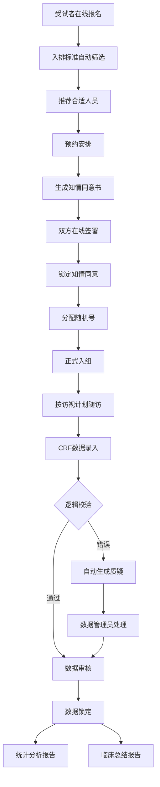
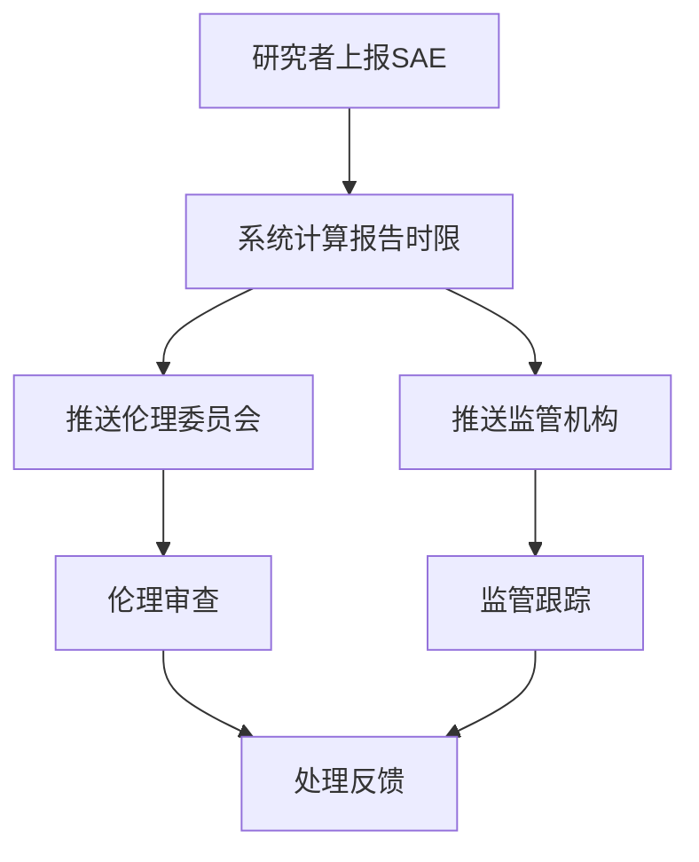

## 1. 产品概述

本平台是面向生物医药研发领域的临床试验全流程数字化管理系统，覆盖从受试者招募到数据锁定与统计分析的完整生命周期。通过智能化入排筛选、电子知情同意、CRF自动校验、SAE时限预警、随机化药物分配、伦理在线审查等核心功能，实现临床试验各环节的合规化、自动化和可追溯管理。

- 目标用户：申办方、研究者、临床协调员(CRC)、数据管理员(DM)、伦理委员会(EC)、受试者六类角色
- 核心价值：提升临床试验运营效率，保障数据质量与受试者安全，满足GCP法规合规要求

## 2. 核心功能

### 2.1 用户角色

| 角色 | 注册方式 | 核心权限 |
|------|----------|----------|
| 申办方 | 管理员分配 | 查看全局数据、绩效报告、试验方案管理、预算管理 |
| 研究者 | 管理员分配 | CRF录入与签名、受试者诊疗管理、SAE上报、方案审查 |
| 临床协调员(CRC) | 管理员分配 | 受试者招募协调、知情同意管理、访视安排、文档管理 |
| 数据管理员(DM) | 管理员分配 | CRF数据审核、质疑管理、数据锁定、统计分析 |
| 伦理委员会(EC) | 管理员分配 | 方案审查、知情同意书审查、SAE审查、审批决策 |
| 受试者 | 在线自助注册 | 在线报名、查看知情同意书、电子签名、访视提醒 |

### 2.2 功能模块

1. **工作台首页**：角色仪表盘、待办事项、消息通知、关键指标概览
2. **受试者管理**：在线报名、入排标准自动筛选、受试者列表、知情同意书生成与签署
3. **病例报告表(CRF)**：CRF录入、自动逻辑校验、质疑生成、数据审核
4. **质疑管理**：质疑列表、批量处理、质疑追踪、质疑关闭
5. **不良事件管理**：SAE上报、报告时限计算、自动推送、SAE追踪
6. **监查管理**：各中心数据查看、异常值标记、监查任务生成与分配
7. **随机化与药物管理**：随机号生成、药物分配、盲态管理
8. **伦理审查**：方案在线审查、知情同意书审查、审批流程、状态更新
9. **访视管理**：访视计划、周期提醒、依从性记录
10. **数据锁定与统计**：数据锁定、统计分析报告、临床总结报告
11. **绩效报告**：入组进度、数据质量评分、AE发生率、月度绩效自动推送
12. **消息中心**：实时消息推送、凭证下载、通知设置

### 2.3 页面详情

| 页面名称 | 模块名称 | 功能描述 |
|----------|----------|----------|
| 登录页 | 用户认证 | 角色选择登录、JWT令牌认证 |
| 工作台 | 仪表盘 | 角色专属指标卡片、待办事项列表、快捷入口 |
| 工作台 | 消息通知 | 实时消息列表、已读未读标记、详情跳转 |
| 受试者列表 | 受试者管理 | 受试者搜索筛选、状态标签、批量操作 |
| 受试者报名 | 受试者管理 | 在线报名表单、入排标准自动校验、推荐结果展示 |
| 入排筛选 | 受试者管理 | 入排标准配置、自动匹配评分、筛选结果详情 |
| 知情同意书 | 受试者管理 | 模板生成、在线预览、电子签名、锁定确认 |
| CRF录入 | 病例报告表 | 表单录入、实时校验提示、自动生成质疑 |
| CRF审核 | 病例报告表 | 数据审核、逻辑错误高亮、审核签名 |
| 质疑列表 | 质疑管理 | 质疑筛选排序、批量处理、状态追踪 |
| SAE上报 | 不良事件管理 | SAE表单填写、时限自动计算、推送确认 |
| SAE追踪 | 不良事件管理 | SAE状态跟踪、报告历史、时限预警 |
| 监查中心 | 监查管理 | 各中心数据总览、异常标记、任务分配 |
| 监查任务 | 监查管理 | 任务列表、处理状态、可疑记录详情 |
| 随机化配置 | 随机化与药物管理 | 方案配置、分层因素、随机号生成规则 |
| 药物分配 | 随机化与药物管理 | 随机号分配、药物编号关联、盲态控制 |
| 伦理审查 | 伦理审查 | 方案文档审查、知情同意书审查、审批流程 |
| 审批管理 | 伦理审查 | 审批意见、通过/驳回、状态自动更新 |
| 访视计划 | 访视管理 | 访视窗口期配置、自动提醒规则、依从性记录 |
| 数据锁定 | 数据锁定与统计 | 锁定操作、锁定日志、解锁申请 |
| 统计报告 | 数据锁定与统计 | 自动生成分析报告、临床总结、导出下载 |
| 绩效报告 | 绩效报告 | 月度统计图表、中心对比、推送到管理层 |
| 消息中心 | 消息系统 | 消息列表、凭证下载、通知偏好设置 |

## 3. 核心流程

### 受试者入组流程
受试者在线报名 → 系统根据入排标准自动筛选 → 推荐合适人员 → 预约安排 → 生成知情同意书 → 双方在线签署 → 锁定知情同意 → 分配随机号 → 正式入组

### CRF与数据管理流程
研究者录入CRF → 系统自动逻辑校验 → 发现错误自动生成质疑 → 数据管理员批量处理质疑 → 质疑关闭 → 数据审核 → 数据锁定

### SAE上报流程
研究者上报SAE → 系统自动计算报告时限 → 自动推送伦理委员会和监管机构 → 跟踪处理状态 → 时限预警提醒

### 监查流程
监查员查看各中心数据 → 系统异常值自动标记 → 生成可疑记录 → 自动生成监查任务 → 监查员处理 → 关闭任务

### 伦理审查流程
提交试验方案/知情同意书 → 伦理委员会在线审查 → 审批/驳回 → 审批通过后系统自动更新状态

## 4. 用户界面设计

### 4.1 设计风格

- **主色调**：深青色(#0F766E)代表专业与可信，搭配琥珀色(#D97706)作为警示与强调色
- **辅助色**：石板灰(Zinc)系列用于背景与文字，红色(#DC2626)用于紧急/SAE标识
- **按钮风格**：圆角8px，带微妙阴影，主按钮填充色，次按钮描边样式
- **字体**：标题使用思源黑体(Noto Sans SC)，正文使用系统字体栈，数据表格使用等宽字体
- **布局风格**：左侧固定导航栏 + 顶部面包屑 + 内容区卡片式布局
- **图标**：使用Lucide图标库，线性风格，统一2px描边
- **整体风格**：医疗级专业界面，清晰的信息层级，大量留白确保可读性，表格数据密集但有序

### 4.2 页面设计概览

| 页面名称 | 模块名称 | UI元素 |
|----------|----------|--------|
| 登录页 | 用户认证 | 居中登录卡片，品牌Logo，角色选择下拉框，渐变背景，微妙粒子动画 |
| 工作台 | 仪表盘 | 4列指标卡片(带图标与趋势箭头)，待办列表(带优先级色条)，快捷入口网格 |
| 工作台 | 消息通知 | 右侧滑出面板，消息类型图标区分，未读红点，时间戳 |
| 受试者列表 | 受试者管理 | 顶部搜索栏+筛选器，数据表格(状态彩色标签)，分页器，批量操作工具栏 |
| 受试者报名 | 受试者管理 | 多步骤表单，步骤进度条，入排标准自动匹配结果(绿色通过/红色不通过) |
| 知情同意书 | 受试者管理 | 文档预览区(左)，签名区(右)，签名板，锁定状态徽章 |
| CRF录入 | 病例报告表 | 分模块标签页，表单字段分组，实时校验红色边框+提示，自动质疑弹出 |
| 质疑列表 | 质疑管理 | 数据表格(质疑类型标签)，批量选择复选框，批量操作按钮组，筛选侧边栏 |
| SAE上报 | 不良事件管理 | 紧急红色主题表单，时限倒计时显示，推送确认弹窗 |
| 监查中心 | 监查管理 | 中心选择器，数据概览图表(柱状图)，异常值红色高亮行，任务卡片 |
| 随机化配置 | 随机化与药物管理 | 方案参数表单，分层因素列表，随机号序列预览，药物编号表格 |
| 伦理审查 | 伦理审查 | 文档查看器(左)，审批意见表单(右)，审批时间线，状态标签 |
| 访视计划 | 访视管理 | 时间轴视图，访视窗口期色块，依从性进度条，提醒设置开关 |
| 数据锁定 | 数据锁定与统计 | 锁定确认弹窗(二次确认)，锁定日志时间线，解锁申请表单 |
| 统计报告 | 数据锁定与统计 | 报告预览区，图表可视化(ECharts)，导出按钮组，报告封面 |
| 绩效报告 | 绩效报告 | 月度数据看板，中心对比雷达图，入组趋势折线图，推送状态指示 |
| 消息中心 | 消息系统 | 消息分类标签页，消息详情展开，凭证下载按钮，通知设置开关 |

### 4.3 响应式设计

- 桌面端优先设计（1440px+），支持1280px以上正常使用
- 导航栏在1024px以下折叠为汉堡菜单
- 数据表格支持横向滚动
- 移动端(768px以下)简化为单列布局，卡片堆叠

### 4.4 3D场景指导

不适用，本平台为2D数据密集型管理界面。
