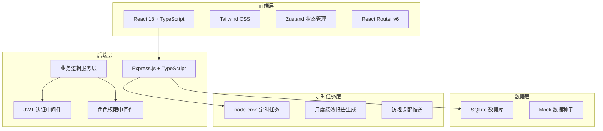
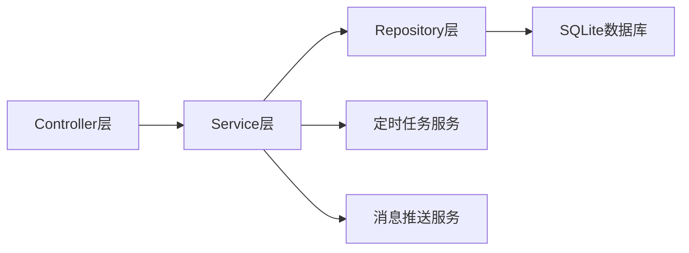
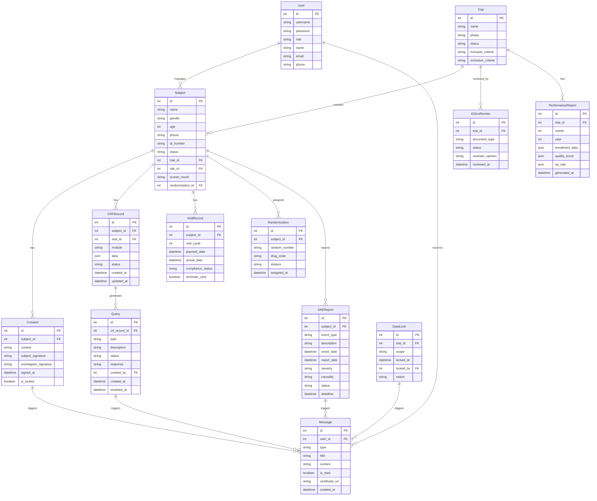

## 1. 架构设计



## 2. 技术说明

- **前端**: React@18 + TypeScript + Tailwind CSS@3 + Vite
- **初始化工具**: vite-init (react-express-ts模板)
- **后端**: Express@4 + TypeScript (ESM格式)
- **数据库**: SQLite (better-sqlite3)，使用Mock数据种子
- **状态管理**: Zustand
- **路由**: React Router v6
- **定时任务**: node-cron
- **图表**: ECharts (echarts + echarts-for-react)
- **签名**: react-signature-canvas
- **PDF**: @react-pdf/renderer (知情同意书/报告生成)
- **图标**: lucide-react

## 3. 路由定义

| 路由 | 用途 | 权限角色 |
|------|------|----------|
| `/login` | 登录页面 | 公开 |
| `/dashboard` | 工作台首页 | 全部角色 |
| `/subjects` | 受试者列表 | 研究者/CRC/DM/申办方 |
| `/subjects/enroll` | 受试者报名 | 受试者/CRC |
| `/subjects/:id` | 受试者详情 | 研究者/CRC/DM |
| `/subjects/:id/consent` | 知情同意书 | 受试者/CRC/研究者 |
| `/crf` | CRF列表 | 研究者/DM |
| `/crf/:id` | CRF录入/查看 | 研究者/DM |
| `/queries` | 质疑管理 | DM/研究者 |
| `/sae` | SAE列表 | 研究者/EC/申办方 |
| `/sae/report` | SAE上报 | 研究者 |
| `/sae/:id` | SAE详情 | 研究者/EC/申办方 |
| `/monitoring` | 监查中心 | 申办方/监查员 |
| `/randomization` | 随机化与药物管理 | 申办方/DM |
| `/ethics` | 伦理审查 | EC/申办方 |
| `/visits` | 访视管理 | CRC/研究者/受试者 |
| `/data-lock` | 数据锁定 | DM/申办方 |
| `/statistics` | 统计报告 | DM/申办方 |
| `/performance` | 绩效报告 | 申办方 |
| `/messages` | 消息中心 | 全部角色 |

## 4. API定义

### 4.1 认证相关
```
POST   /api/auth/login          - 用户登录
POST   /api/auth/register       - 受试者注册
GET    /api/auth/me             - 获取当前用户信息
```

### 4.2 受试者管理
```
GET    /api/subjects             - 获取受试者列表
POST   /api/subjects/enroll      - 受试者报名
POST   /api/subjects/screen      - 入排标准筛选
GET    /api/subjects/:id         - 获取受试者详情
PUT    /api/subjects/:id/status  - 更新受试者状态
```

### 4.3 知情同意
```
GET    /api/consent/:subjectId   - 获取知情同意书
POST   /api/consent/sign         - 签署知情同意
PUT    /api/consent/:id/lock     - 锁定知情同意
```

### 4.4 CRF与质疑
```
GET    /api/crf                  - 获取CRF列表
GET    /api/crf/:id              - 获取CRF详情
POST   /api/crf/:id/save         - 保存CRF数据
POST   /api/crf/validate         - CRF逻辑校验
GET    /api/queries              - 获取质疑列表
POST   /api/queries/batch        - 批量处理质疑
PUT    /api/queries/:id          - 回复/关闭质疑
```

### 4.5 SAE管理
```
GET    /api/sae                  - 获取SAE列表
POST   /api/sae/report           - 上报SAE
GET    /api/sae/:id              - 获取SAE详情
PUT    /api/sae/:id/status       - 更新SAE状态
GET    /api/sae/:id/deadline     - 获取报告时限
```

### 4.6 监查管理
```
GET    /api/monitoring/centers   - 获取中心数据
GET    /api/monitoring/anomalies - 获取异常标记记录
GET    /api/monitoring/tasks     - 获取监查任务
PUT    /api/monitoring/tasks/:id - 处理监查任务
```

### 4.7 随机化与药物
```
POST   /api/randomization/config - 配置随机化方案
POST   /api/randomization/generate - 生成随机号
POST   /api/randomization/assign - 分配随机号/药物
GET    /api/randomization/list   - 获取随机号列表
```

### 4.8 伦理审查
```
GET    /api/ethics/submissions   - 获取审查列表
POST   /api/ethics/submit        - 提交审查
PUT    /api/ethics/:id/review    - 审批操作
GET    /api/ethics/:id           - 审查详情
```

### 4.9 访视管理
```
GET    /api/visits/plan          - 获取访视计划
GET    /api/visits/schedule      - 获取访视安排
PUT    /api/visits/:id/compliance - 记录依从性
GET    /api/visits/reminders     - 获取访视提醒
```

### 4.10 数据锁定与统计
```
POST   /api/data-lock/lock       - 数据锁定
POST   /api/data-lock/unlock     - 申请解锁
GET    /api/data-lock/log        - 锁定日志
GET    /api/statistics/report    - 获取统计报告
GET    /api/statistics/summary   - 获取临床总结
```

### 4.11 绩效与消息
```
GET    /api/performance/monthly  - 获取月度绩效
GET    /api/messages             - 获取消息列表
PUT    /api/messages/:id/read    - 标记已读
GET    /api/messages/:id/certificate - 下载凭证
```

## 5. 服务器架构图



## 6. 数据模型

### 6.1 数据模型定义



### 6.2 数据定义语言

```sql
CREATE TABLE users (
    id INTEGER PRIMARY KEY AUTOINCREMENT,
    username TEXT NOT NULL UNIQUE,
    password TEXT NOT NULL,
    role TEXT NOT NULL CHECK(role IN ('sponsor','investigator','crc','dm','ec','subject')),
    name TEXT NOT NULL,
    email TEXT,
    phone TEXT,
    created_at DATETIME DEFAULT CURRENT_TIMESTAMP
);

CREATE TABLE trials (
    id INTEGER PRIMARY KEY AUTOINCREMENT,
    name TEXT NOT NULL,
    phase TEXT NOT NULL,
    status TEXT DEFAULT 'active',
    inclusion_criteria TEXT,
    exclusion_criteria TEXT,
    created_at DATETIME DEFAULT CURRENT_TIMESTAMP
);

CREATE TABLE subjects (
    id INTEGER PRIMARY KEY AUTOINCREMENT,
    name TEXT NOT NULL,
    gender TEXT NOT NULL,
    age INTEGER NOT NULL,
    phone TEXT,
    id_number TEXT,
    status TEXT DEFAULT 'enrolled' CHECK(status IN ('enrolled','screening','eligible','consented','randomized','active','completed','withdrawn')),
    trial_id INTEGER REFERENCES trials(id),
    site_id INTEGER,
    screen_result TEXT,
    randomization_id INTEGER,
    created_at DATETIME DEFAULT CURRENT_TIMESTAMP
);

CREATE TABLE consents (
    id INTEGER PRIMARY KEY AUTOINCREMENT,
    subject_id INTEGER REFERENCES subjects(id),
    content TEXT NOT NULL,
    subject_signature TEXT,
    investigator_signature TEXT,
    signed_at DATETIME,
    is_locked BOOLEAN DEFAULT 0,
    created_at DATETIME DEFAULT CURRENT_TIMESTAMP
);

CREATE TABLE crf_records (
    id INTEGER PRIMARY KEY AUTOINCREMENT,
    subject_id INTEGER REFERENCES subjects(id),
    visit_id INTEGER,
    module TEXT NOT NULL,
    data TEXT NOT NULL,
    status TEXT DEFAULT 'draft' CHECK(status IN ('draft','submitted','verified','locked')),
    created_at DATETIME DEFAULT CURRENT_TIMESTAMP,
    updated_at DATETIME DEFAULT CURRENT_TIMESTAMP
);

CREATE TABLE queries (
    id INTEGER PRIMARY KEY AUTOINCREMENT,
    crf_record_id INTEGER REFERENCES crf_records(id),
    type TEXT NOT NULL,
    description TEXT NOT NULL,
    status TEXT DEFAULT 'open' CHECK(status IN ('open','answered','closed')),
    response TEXT,
    created_by INTEGER REFERENCES users(id),
    created_at DATETIME DEFAULT CURRENT_TIMESTAMP,
    resolved_at DATETIME
);

CREATE TABLE sae_reports (
    id INTEGER PRIMARY KEY AUTOINCREMENT,
    subject_id INTEGER REFERENCES subjects(id),
    event_type TEXT NOT NULL,
    description TEXT NOT NULL,
    onset_date DATETIME NOT NULL,
    report_date DATETIME DEFAULT CURRENT_TIMESTAMP,
    severity TEXT NOT NULL,
    causality TEXT,
    status TEXT DEFAULT 'reported' CHECK(status IN ('reported','reviewing','closed')),
    deadline DATETIME
);

CREATE TABLE randomizations (
    id INTEGER PRIMARY KEY AUTOINCREMENT,
    subject_id INTEGER REFERENCES subjects(id),
    random_number TEXT NOT NULL UNIQUE,
    drug_code TEXT,
    stratum TEXT,
    assigned_at DATETIME DEFAULT CURRENT_TIMESTAMP
);

CREATE TABLE ethics_reviews (
    id INTEGER PRIMARY KEY AUTOINCREMENT,
    trial_id INTEGER REFERENCES trials(id),
    document_type TEXT NOT NULL,
    status TEXT DEFAULT 'pending' CHECK(status IN ('pending','approved','rejected')),
    reviewer_opinion TEXT,
    reviewed_at DATETIME,
    created_at DATETIME DEFAULT CURRENT_TIMESTAMP
);

CREATE TABLE visit_records (
    id INTEGER PRIMARY KEY AUTOINCREMENT,
    subject_id INTEGER REFERENCES subjects(id),
    visit_cycle INTEGER NOT NULL,
    planned_date DATETIME NOT NULL,
    actual_date DATETIME,
    compliance_status TEXT DEFAULT 'pending' CHECK(status IN ('pending','completed','missed','late')),
    reminder_sent BOOLEAN DEFAULT 0,
    created_at DATETIME DEFAULT CURRENT_TIMESTAMP
);

CREATE TABLE data_locks (
    id INTEGER PRIMARY KEY AUTOINCREMENT,
    trial_id INTEGER REFERENCES trials(id),
    scope TEXT NOT NULL,
    locked_at DATETIME,
    locked_by INTEGER REFERENCES users(id),
    status TEXT DEFAULT 'locked' CHECK(status IN ('locked','unlock_requested','unlocked'))
);

CREATE TABLE messages (
    id INTEGER PRIMARY KEY AUTOINCREMENT,
    user_id INTEGER REFERENCES users(id),
    type TEXT NOT NULL,
    title TEXT NOT NULL,
    content TEXT NOT NULL,
    is_read BOOLEAN DEFAULT 0,
    certificate_url TEXT,
    created_at DATETIME DEFAULT CURRENT_TIMESTAMP
);

CREATE TABLE performance_reports (
    id INTEGER PRIMARY KEY AUTOINCREMENT,
    trial_id INTEGER REFERENCES trials(id),
    month INTEGER NOT NULL,
    year INTEGER NOT NULL,
    enrollment_data TEXT,
    quality_score TEXT,
    ae_rate TEXT,
    generated_at DATETIME DEFAULT CURRENT_TIMESTAMP
);
```
